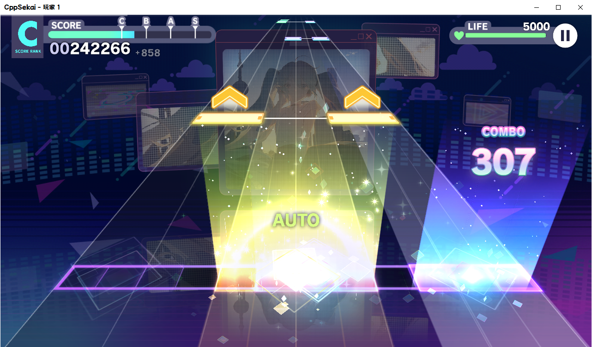
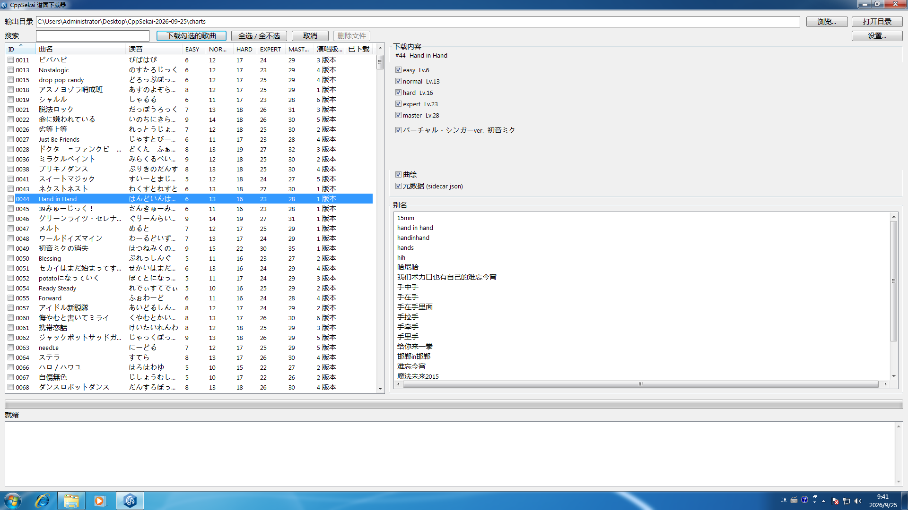
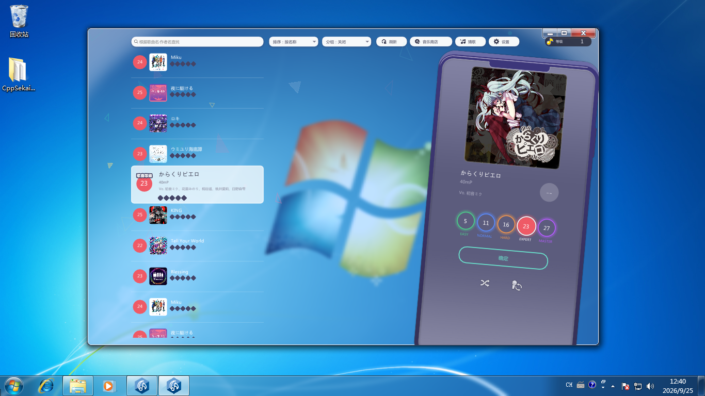
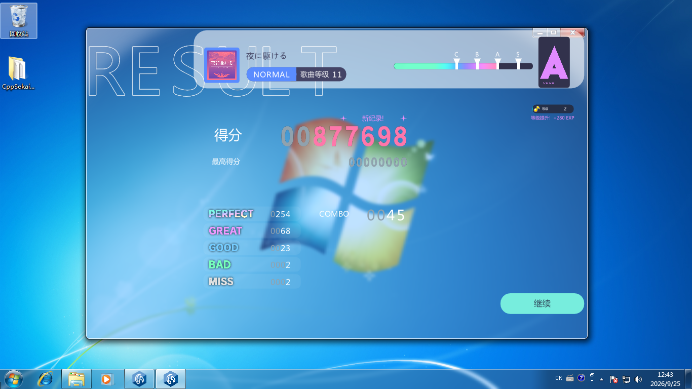
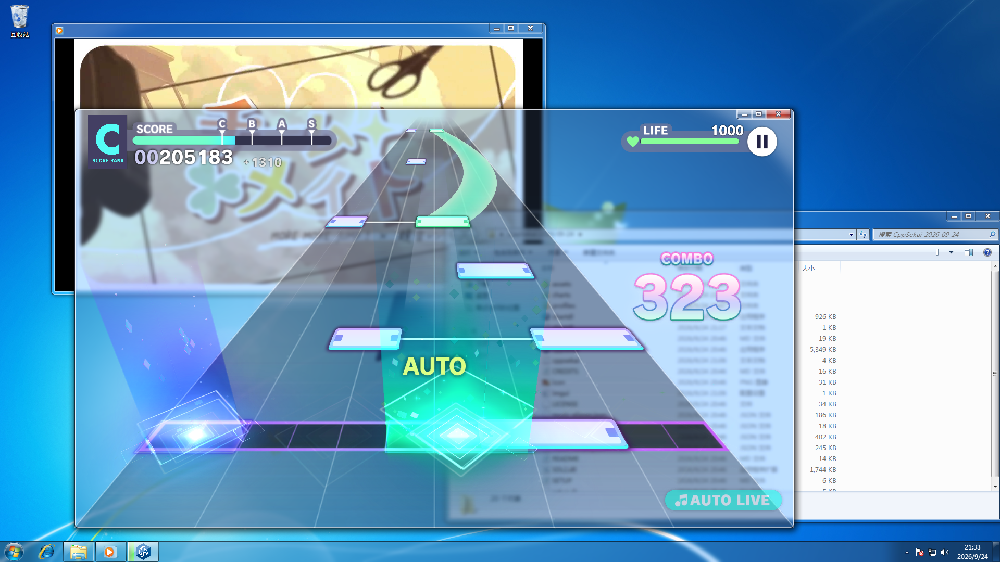
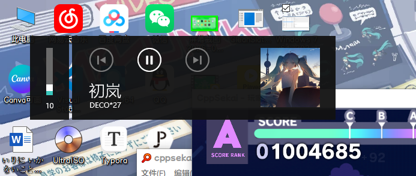
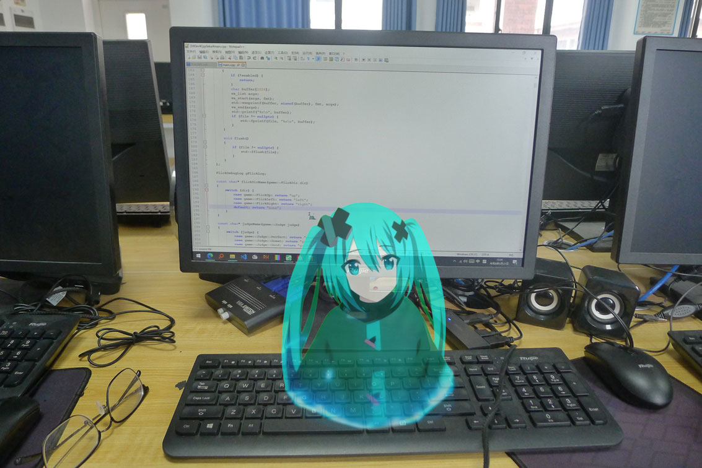

# CppSekai PJSK 模拟器

在班上垃圾希沃使用 Windows 原生触摸享受和同学打烤的快乐。上课放 PPT，下课打 PJSK。

---

## 功能特性

- **SUS 谱面原生解析演奏**：12 轨，所有音符全部支持。

- **最牛逼的性能优化**：没有 Electron，没有引擎，release 带了资源都只有 6.9MB，纯 C++ 编写性能负担极低，老赛扬都能玩。
- **自带音乐商店**：国服日服随便下。

- **判定、结算页面对齐原作**：一比一高度还原。

- **三种输入共用一条路径**：专为触屏 Windows 设计，但键盘 12 键、鼠标左右键也能玩，还可以使用 Xbox 手柄操作界面 UI 元素。
- **本地多人**：同一台机器开几个窗口一起打，和同学在班上拼机。
- **别名搜索数据库**：自带超大数据库（约 1.2 万条），海底谭你搜海底捞，モニタニング你搜视奸都能识别。
- **系统集成和特性适配**：Windows 媒体浮层（SMTC）显示曲名与进度，任务栏按钮上跑进度条（都只在 Win10+）在 Win7 上还能开启全局 Aero。

---

## 跑起来

Win7 上还得装一次 UCRT / VC++ 2015-2022 运行库（当然学校电脑基本上都打了补丁，直接跑就行）；Win10+ 开箱即用。

双击 `cppsekai.exe` 开始游玩，双击 `chartdl.exe` 下载谱面。

## 操作

| 输入 | 操作 | 说明 |
| --- | --- | --- |
| 键盘 | `Z S X D C V G B H N J M` | 12 条轨，`Z` 在最左 |
| 键盘 | `SPACE` | 暂停|
| 键盘 | `F` / `H` / `ESC` | 全屏切换 / 设置面板 / 返回 |
| 键盘 | `F5` | 选歌界面重新扫描 `charts/`|
| 鼠标 | 左键 / 右键 | 各算一个指针，按住不放为长条 |
| 触摸 | 多指 | 多指同时判定 |
| 手柄 | 方向键 / 左摇杆 | 上下选歌 + 换难度|
| 手柄 | `A` / `START` / `Y` | 开打 / 设置面板/ 重新扫描 |
| 手柄 | `B` / `BACK` | 关掉当前弹窗或设置卡，等同 `ESC` |

---

## Q&A
**Q：为什么叫这个名字？**
A：为了强调这个项目使用纯 C++ 制作（其实是我根本就不会起名字）

**Q：为什么没有歌 / 列表里是空的？**
A：仓库不自带谱面与音频。打开附带的 `chartdl.exe` 下载谱面。

**Q：放进去了却不显示 / 歌名显示成 `xxxx master`？**
A：前者基本是文件名不符合 `<4位id>_<难度>.sus`（或没按 F5 重扫）；后者是缺 sidecar 的 `title`。逐条对照见 **[CHARTS.md](CHARTS.md)** 的「常见问题」。

**Q：长条（hold）什么时候算断？**
A：尾判是**松手判定**，结束前在容错窗口内松手给 Perfect / Great / Good，一直按到底也是 Perfect，只有明显提前松手才断连。窗口在 **设置 → 判定 → 长条容错**。

**Q：键盘打不出左右 flick？**
A：键盘一个键没有方向，只能发向上 flick；左右方向必须用鼠标或触摸。触摸屏上滑很难触发的话，开 **设置 → 判定 → Flick 视作 Tap**。

**Q：手柄能打歌吗？**
A：不能，手柄只做菜单。12 轨的东西手柄打不了，这是有意的（

**Q：触摸屏能用吗？多指呢？**
A：能。触摸走 SDL 的 touch→mouse 合成，多指对应多轨；不想看到系统那圈触摸涟漪可以在设置里关掉。

**Q：怎么和别人一起打（同机联机）？**
A：**设置 → 系统 → 多人游玩**：重启后再次双击 exe 会出现新窗口，有几个人你就开几个窗口，一般都能自动连上去。

**Q：为什么这首歌没有切换歌手 / 面板里只有一个版本？**
A：面板只列出**你谱面目录里真的存在音频的演唱版本**（`se_/vs_/an_/cl_<id>_<n>.mp3`），有几个就显示几张卡。

**Q：为什么没有 3D MV / live2d / 角色？**
A：目前仅仅是一个谱面播放器。

**Q：Windows 7 能跑吗？**
A：能（SP1 起），但要自己装一次 **UCRT / VC++ 2015-2022 运行库**；Win10+ 开箱即用。媒体浮层（SMTC）与任务栏进度条只有 Win10+ 才有。

**Q：双击没反应 / 报缺 DLL？**
A：`SDL2.dll` 必须和 exe 放同一目录。日志写在**当前工作目录**的 `cppsekai.log`，先看它最后几行。

**Q：能跑在 Linux / macOS / 手机上吗？**
A：只做 Windows 原生：平台层用了 Win32 的媒体会话、任务栏进度和命名共享内存。想看网页版可以去上游 [sekai-mmw-preview-web](https://github.com/watagashi-uni/sekai-mmw-preview-web)。

**Q：会联网吗？会上传什么吗？**
A：游戏本体**没有任何网络代码**。只有 `chartdl.exe` 下载谱面时会联网（地址来自公开的资源镜像），也不上传任何东西。

---

## 我真的看见叉葱了（

「世界」是由「心愿」构成的地方，而我正在构建一个sekai来实现在学校打烤的心愿（

（别问我为什么拿 npp 写，你见过哪个正经开发者电脑只有 4GB RAM）

---

## 画饼
如果我还有时间，我会：

- 继续完善多人模式支持
- 添加中二手台支持（？要不你送我一台吧（

---

## 授权与素材

- 代码遵循 **AGPL-3.0-only**。
  - 上游：[sekai-mmw-preview-web](https://github.com/watagashi-uni/sekai-mmw-preview-web)（AGPL-3.0）——谱面核心与渲染布局来自这里
  - 再上游：MikuMikuWorld（MIT）——`core/native/mmw_port/` 的移植来源
  - 第三方库（imgui / miniaudio / stb / nlohmann-json / DirectXMath）各自遵循宽松许可
- **素材全部属于 SEGA / Colorful Palette**：`assets/` 与 `charts/` 是官方游戏素材与数据，**仅限本地游玩**。
- 本项目与官方无关；如有侵权请联系移除。

参考资料和版权信息参见 **[CREDITS.md](CREDITS.md)** 和 **[COPYRIGHT.md](COPYRIGHT.md)** （内容由 AI 生成）
