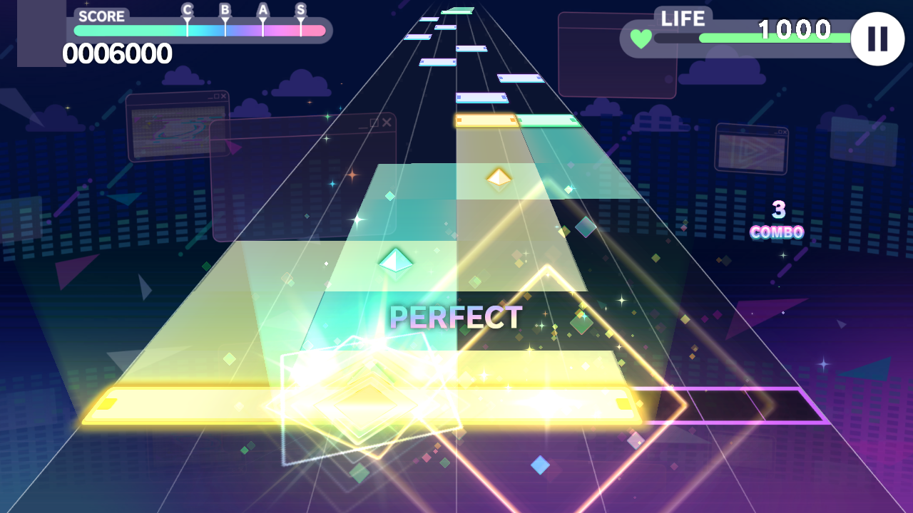
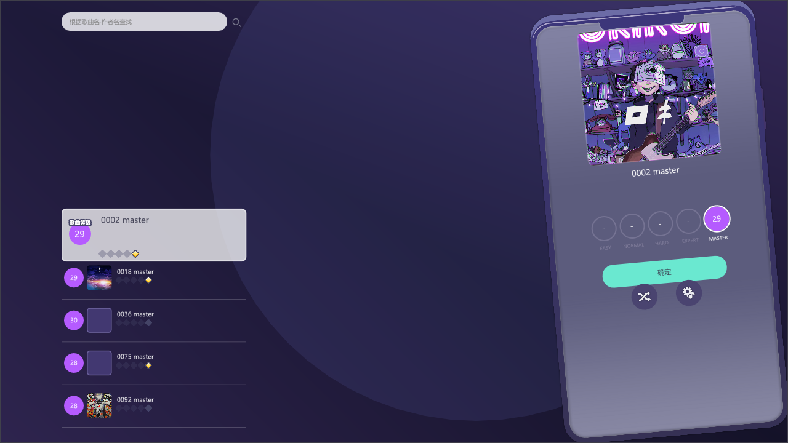
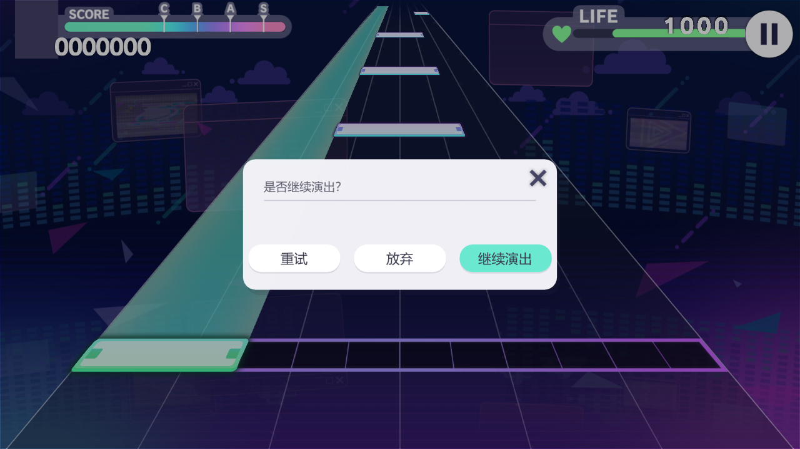
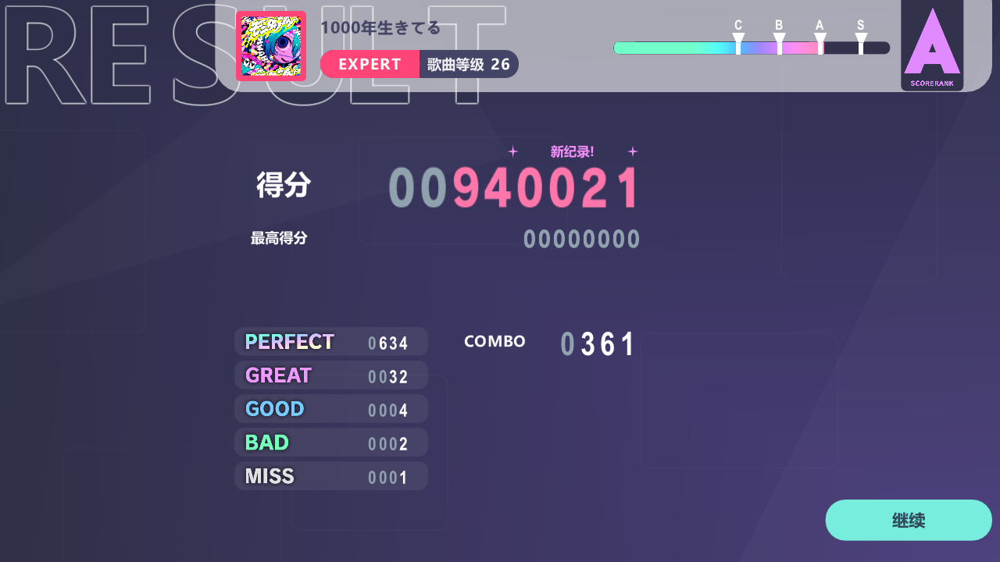
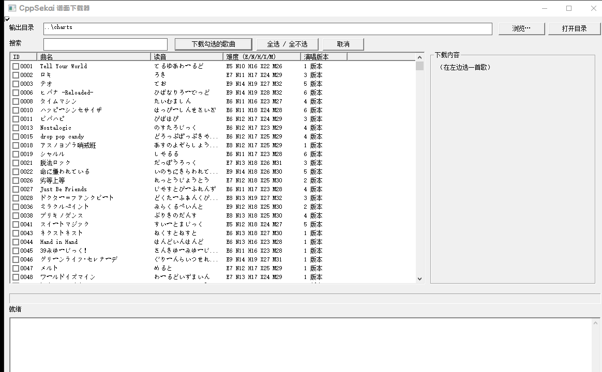

# CppSekai

> **把 Project SEKAI 的 SUS 谱面，做成一个双击就能玩的 Windows 原生 exe。**

没有 Electron，没有浏览器，没有 Unity，没有引擎，没有一个需要用户安装的运行库。
zig 把 C++20 静态链成一个 ~4.8 MB 的 `cppsekai.exe`，SDL2 给窗口和输入，OpenGL 3.3 core 直接上屏。

```
  谱面文件 (.sus)  →  判定事件流  →  ┐
                   →  打包 quad 流 →  ├→  一个 exe
  音频文件 (.mp3)  →  PCM 帧时钟   →  ┘
```

---

## 目录

| 演奏 | 选歌 | 暂停 |
|---|---|---|
|  |  |  |

| 结算 | |
|---|---|
|  | |

这些图都是无头模式（`--screenshot`）真跑出来的帧，不是画的，也不是渲染图。

---

## 1. 它到底能干什么

- **SUS 谱面原生解析 + 演奏**：12 轨，tap / critical tap / flick / trace(friction) / hold 全部支持。
- **判定对齐原作**：PERFECT/GREAT/GOOD/BAD/MISS 五档判定，GOOD 及以下断连击；hold 中途松手断连（-40 血），**重新按住可以接上**，断开期间的 tick 保持 miss；hold 尾巴按松手时机评级。
- **三种输入共用一条路径**：键盘 12 键、鼠标左/右键（当成两个指针）、多指触摸，全部走同一个「屏幕 → 裁剪空间 → 世界轨道坐标」的逆变换。**触摸屏对全部 UI（选曲/设置/弹窗）同样有效**。
- **真·游戏特效**：命中特效不是自己糊的粒子，而是谱面核心自带的 pjsk 粒子系统（`effect.png` + 内嵌效果定义），帧序、时长、叠加混合与官方一致。
- **音频时钟即主时钟**：不用 wall clock 猜时间，直接从音频设备的 PCM 帧计数推 `songTime`，音画天然对齐。
- **自动吃掉官方音频的开头静音**：官服 mp3 前面有 ~9 秒填充，谱面 tick 0 在那之后。程序会自己扫出来（或读 sidecar），不需要手动对轴。
- **选歌 → 演奏 → 结算 → 暂停弹窗 → 3-2-1 倒计时 → 继续演出**，一套完整流程：`确定` / `重试` / `放弃` / `继续演出`，通关与 FULL COMBO 连同设置一起存进 `userdata.json`。**血量掉到 0 的曲子不算通关**（打完但没活着 = failed，只在选曲界面留最高分，不打 CLEAR）。开场卡片右下角有「跳过 >>」按钮，直接跳到谱面 0 秒开打。
- **结算画面照原版 1:1 复刻**：得分（超出历史最佳的位数标红 + 「新纪录!」）、C/B/A/S 评级进度条、SCORERANK 牌子、PERFECT～MISS 计数与 COMBO，数字用的是游戏自己的记分精灵，不是字体凑的。点「继续」回选曲。
- **设置齐全**（H 键或选曲界面的设置按钮，分演奏 / 画面 / 判定 / 系统四页）：音频偏移、音符速度、分辨率预设、窗口模式、帧率上限、播放进度条开关、AUTOPLAY 预览、判定窗口、严格 Flick 方向、失焦自动暂停、SMTC 汇报开关，全部持久化到 `userdata.json`。
- **系统集成**：Windows 媒体浮层（SMTC）显示曲名/进度（设置里可关），任务栏按钮上跑进度条；演奏界面顶端还有一条 3px 的半透明播放进度条。
- **无头自检**：`--screenshot` 能不开窗口跑一帧存 PNG，改渲染不用靠肉眼盯屏幕。

---

## 2. 30 秒跑起来

```bash
bash setup.sh          # 拉工具链（zig 0.14.1 + SDL2 2.32.10）和贴图/音效资源
bash build.sh          # 编译，产物在 build/
cd build && ./cppsekai.exe
```

想顺便来两张测试谱面：

```bash
bash setup.sh --charts     # 额外下载 0075 / 0127 两张谱 + BGM 到 charts/
```

**不需要** Visual Studio、cmake、vcpkg、Python 环境。Windows 7 SP1 起，2008 年之后的核显就能跑。

> 想下别的歌？仓库不自带谱面（官方素材不入库）→ 看 **[CHARTS.md](CHARTS.md)**：
> 命名规则、unipjsk 下载地址、元数据 sidecar、常见问题都在里面。

---

## 3. 操作

| 输入 | 操作 | 说明 |
|---|---|---|
| 键盘 | `Z S X D C V G B H N J M` | 12 个键 = 12 条轨，`Z` 在最左 |
| 键盘 | `SPACE` | 暂停（开暂停弹窗） |
| 键盘 | `F` / `H` / `ESC` | 全屏切换 / 调试面板 / 返回·退出 |
| 键盘 | `F5` | 选歌界面重新扫描 `charts/`（加完谱面不用重启） |
| 鼠标 | 左键 / 右键 | 各算一个指针（可同时压两个轨）；按住不放 = 长条 |
| 鼠标 | 拖拽上 / 左 / 右 | Flick，方向必须与箭头一致（严格模式默认开） |
| 触摸 | 多指 + 上滑 / 左右滑 | 多指同时判定 |
| 键盘打 flick | 无方向 | 只能清「上/无方向」的 flick；**左/右 flick 必须用鼠标拖拽或触摸** |
| 鼠标/触摸 | 点 HUD、面板、弹窗 | **永远不当作击打**（先做 ImGui 占用检测 + 暂停按钮命中测试） |
| 触摸 | 点选曲 / 设置 / 弹窗 | 触摸会合成鼠标事件喂给 UI，所有界面元素都能点 |
| 鼠标/触摸 | 选曲列表滚动 | 滚轮 / 拖拽 / 触摸滑动都行；**滚动过程中不高亮**，松手后停在列表中间的那首才被选中。列表没有滚动条，而且是**首尾相接的循环**：滚过最后一首接着就是第一首 |
| 鼠标/触摸 | 单击某一行 / 双击 | 单击 = 选中并把它滑到中间，双击 = 直接开打 |
| 鼠标/触摸 | 排序 / 分组 | 搜索框右边两个下拉框：排序「按名称（官方读音）/ 按难度」，分组「关闭 / 按难度段 / 按读音（あ か さ…，英文按字母分段）/ 按首字（逐假名）」 |

---

## 3.5 设置面板（`H` 键或选曲界面的设置按钮）

| 页签 | 项 | 说明 |
|---|---|---|
| 演奏 | 音频偏移 | −2000～+2000 ms，实时生效 |
| 演奏 | 音符速度 | 1–12，实时生效 |
| 画面 | 分辨率 | 1280×720 / 1600×900 / 1920×1080 / 2560×1440，非全屏时立即改窗口并居中；全屏下选了等退出全屏再生效 |
| 画面 | 窗口模式 | borderless / windowed / fullscreen |
| 画面 | 帧率上限 | 0 = 仅垂直同步；超过显示器刷新率会自动关垂直同步 |
| 画面 | 显示播放进度条 | 演奏界面顶端的 3px 半透明进度条 |
| 画面 | AUTOPLAY 谱面预览 | 全 PERFECT 自动演示，不写成绩 |
| 判定 | 判定窗口 | Perfect/Great/Good 三档（ms），联动 BAD/MISS 边界 |
| 判定 | 严格 Flick 方向 | 开启后点按永远清不掉 flick、方向必须匹配 |
| 系统 | 失焦时自动暂停 | 关掉后切出去（Alt-Tab / 弹窗抢焦点）歌会继续跑 |
| 系统 | 启用 SMTC 汇报 | 关掉后整段退出系统媒体会话，音量浮层/媒体小组件保持你原来在放的东西 |

全部设置随 `userdata.json` 持久化，命令行参数优先于保存值。

---

## 4. 命令行

```
cppsekai [--sus <file.sus>] [--bgm <audio>] [--charts <dir>]
         [--offset <sec>] [--filler <sec>] [--auto] [--speed <1-12>]
         [--se-volume <0-1>] [--lead-in <sec>] [--cover <image>]
         [--screenshot <png>] [--screenshot-time <sec>] [--pjsk-font]
         [--title/--lyricist/--composer/--arranger/--vocal/--difficulty <text>]
         [--width <px>] [--height <px>] [--window borderless|windowed|fullscreen]
         [--fps <n>] [--judge-sheet] [--test-hits] [--show-pause-dialog]
```

| 参数 | 作用 |
|---|---|
| `--sus` | 指定谱面；**不给**就进选歌界面 |
| `--charts` | 谱面目录（默认依次试 `exe/charts` → `exe/../charts` → `./charts`，取第一个非空的） |
| `--filler` | BGM 开头静音秒数；不给则自动检测 |
| `--offset` | 手感微调（秒，正 = 音乐更晚出） |
| `--speed` | 音符速度 1–12（设置面板里也能拖） |
| `--lead-in` | 开场卡片 + 淡入的提前量，默认 6.0s，下限 5.8s |
| `--auto` | 自动演示：特效由谱面时间轴触发，不接受输入 |
| `--screenshot` | 无头跑一帧存 PNG 后退出，日志写 `cppsekai.log` |
| `--test-hits` | 不按键，按时间轴把每个音符自动喂给判定引擎（查特效链用） |
| `--test-restart` `--restart-at <sec>` | 走到指定秒数执行「放弃 → 载入下一首」，回归测「重选曲卡死」 |
| `--window/--width/--height/--fps` | 窗口模式与帧率上限（0 = 只靠垂直同步） |
| `--pjsk-font` | 用自带的 pjsk 字体，默认跟随系统 UI 字体 |
| `--help` / `-h` | 打印用法并退出 |

> 完整手册（日志去哪、无头自检、退出码、坑）见 **[CLI.md](CLI.md)**。

---

## 5. 架构：三层，边界非常硬

```
┌──────────────────────────────────────────────────────────────────────┐
│  game/          玩法与界面（本项目新增）                              │
│    Judgement.*  判定引擎：事件流 → Perfect/Great/Good/Miss、combo、分 │
│    Hud.*        分数 / 生命 / 连击 / 判定字（1920x1080 虚拟坐标）      │
│    Intro.*      开场卡片：曲绘 + 作词作曲编曲 + 1.8s 舞台淡入          │
│    SongSelect.* 选歌：扫谱面、配 sidecar、分组、成绩、详情面板         │
│    Ui.*         pjsk 弹窗组件库：卡片/页签/滑条/信息行/胶囊钮/开关      │
├──────────────────────────────────────────────────────────────────────┤
│  platform/      平台层（本项目新增）                                   │
│    Renderer.*   OpenGL 3.3 core，消费核心吐出的 packed quad           │
│    Audio.*      miniaudio：BGM + 10 种判定音 × 4 声部池 + hold 循环音  │
│    CoreApi.cpp  C 接口包装 + #WAVEOFFSET 文本扫描                     │
│    SystemMedia.* 手写 WinRT vtable：SMTC 媒体浮层 + 任务栏进度条       │
│    main.cpp     SDL2 窗口/事件循环/输入映射/ImGui/截图模式             │
├──────────────────────────────────────────────────────────────────────┤
│  core/native/   谱面核心（上游代码，结构不动）                         │
│    mmw_preview.cpp    SUS 解析 → 数据模型 → 绘制数据 → 事件流          │
│    mmw_port/          MikuMikuWorld 移植层（音符/特效/粒子/相机）      │
└──────────────────────────────────────────────────────────────────────┘
```

**数据流一条线：**

```
loadSusTextPrecise ──► 核心全局状态
        │
        ├─ getHitEventBuffer() ─► JudgementEngine::load ─► 每帧 update(songTime)
        │                                                    └─► tap/flick 输入
        │
        └─ render(songTime) ─► 25 floats/quad ─► Renderer::renderFrame ─► glDrawArrays

AudioEngine::songTime()  ← 唯一时钟源 →  判定、渲染、HUD、SMTC 全部读它
```

核心**完全不碰 OpenGL**。它只往两个 buffer 里塞数：一个是「要画什么」（quad），一个是「什么时候该响」（hit event）。
平台层想画在浏览器里就画在浏览器里（上游就是 WebGL），想画在原生窗口里就画在原生窗口里——这就是这套东西能被搬下浏览器的原因。

---

## 6. 原理详解

### 6.1 时间：tick 是唯一真理，秒是算出来的

谱面时间是 **tick**（`TICKS_PER_BEAT = 480`），不是秒。因为 BPM 会变、`#SPEED` 会变，秒和 tick 从来不是线性关系。核心维护三条互相换算的轴：

| 函数 | 输入 → 输出 | 用途 |
|---|---|---|
| `accumulateTicks` | 秒 → tick | 把播放器的当前时间拉回谱面坐标系 |
| `accumulateDuration` | tick → 秒 | 判定、音效、事件的真实时间 |
| `accumulateScaledDuration` | tick → 视觉秒 | **受 hiSpeed 影响**，决定音符画在哪 |

关键点：**判定用真实秒，下落位置用视觉秒**。所以改音符速度只让音符跑得更快，不会让歌对不上。每帧 `render()` 入口就是这几行换算。

### 6.2 空间：没有 3D，只有一个假透视

轨道坐标 `x` 在高度 `y` 上，被画到世界坐标 `(x·y, y)`：

```cpp
// core/native/src/mmw_preview.cpp
QuadPoints perspectiveQuadvPos(float left, float right, float top, float bottom) {
    return {{ {right*top, top}, {right*bottom, bottom}, {left*bottom, bottom}, {left*top, top} }};
}
```

- `y = 1` 是判定线（最宽、最靠下），`y → 0` 是消失点（最窄、最靠上）
- 12 轨的轨道坐标是 `lane - 6 + width/2`，即左半 −6…0，右半 0…6

好处是判定只要一次除法就能把屏幕点还原成轨道坐标，不需要射线求交：

```
窗口像素 → 裁剪空间(clipX, clipY) → worldX / worldY
         → lanePos = worldX / worldY      // 撤销假透视
```

`Renderer::clipToWorldX/Y` 就是这条逆变换（外加 letterbox 的宽高比修正），输入命中和悬停高亮全靠它。

### 6.3 渲染：核心吐数据，平台层画

每个 quad 被打包成 **25 个 float**：

```
[0..11]  4 个顶点 × (x, y, 1/w)      ← 1/w 让透视插值走硬件
[12..19] 4 个顶点 × (u, v)           ← 纹理坐标
[20..23] r, g, b, a
[24]     textureId
```

`textureId` 决定走哪条路：

| id | 贴图 | 坐标空间 | 混合 |
|---|---|---|---|
| 0 | `notes_01.png` | 世界轨道坐标（要 `worldToClip`） | 普通 alpha |
| 1 | `longNoteLine_01.png` | 同上 | 普通 |
| 2 | `touchLine_eff_01.png` | 同上 | 普通 |
| 3 | `effect.png` | **已经是裁剪空间**（核心算好了） | 普通 |
| 4 | `effect.png` | 裁剪空间 | **加法混合** |

顶点着色器里 `gl_Position = vec4(aPos * w, 0, w)`——手动把透视除法交回硬件，这样 4 个顶点可以各带深度，做出真正的梯形收束。

渲染顺序由核心的 `zIndex` 决定（`stable_sort`），平台层只做一件事：**把相邻且贴图相同的 quad 攒成一批再 `glDrawArrays`**，减少状态切换。

### 6.4 判定：事件流 + 时间窗 + 轨道覆盖

SUS 解析完，核心顺带生成 `HitEvent` 流（7 floats/条，按时间排序）：

```
[0] timeSec  [1] center  [2] width  [3] kind  [4] flags  [5] endTimeSec  [6] volume
kind : 0=tap  1=critical tap  2=flick  3=trace  4=hold tick  5=hold 标记
flags: bit0 = critical, bits1-2 = flick 方向 (0 无 / 1 上 / 2 左 / 3 右)
```

判定引擎就是一个游标 + 滑动窗口：

```
输入的那一帧：
  lanePos = 屏幕点逆变换得到轨道坐标
  在 [cursor, cursor+256) 里找 state==0、|dt| 最小、
  且 (note.center ± width/2 ± margin) 盖住 lanePos 的那个音符
  dt ≤ 40ms → PERFECT    dt ≤ 90ms → GREAT    dt ≤ 140ms → GOOD
```

- **超时自动 MISS**：`update()` 每帧扫过 `timeSec < songTime - missAfterMs` 的音符，记 MISS 并把 combo 归零。
- **Flick 严格方向**：flick 音符只在滑动方向匹配时才算过（上滑音符接受「上 / 无方向」，左右滑必须对应方向）；严格模式下点按永远不会清掉 flick，反之亦然。可在设置面板里关。
- **Hold 三段判定**：
  - **起手**：kind 5 标记配合同轨同刻的 tap 判定决定「是否抓到」；
  - **长条持续段**：hold 期间每半拍一个 kind 4 tick，按住时自动 PERFECT 计分（combo 照涨），断开期间的 tick 静默吞掉；
  - **断连与重接**：中途松手 → 断连（MISS、-40 血、combo 归零），长条变灰；**重新按住该轨即重接**，剩余 tick 和尾判恢复正常判定（与原作一致）。断开期间已经吞掉的 tick 不追溯补分；
  - **尾判**：松手时机离结束 ≤Perfect/Great/Good 窗口给对应评级，按到底也是 PERFECT，提前超过 180ms 才算断。
- **分数**：对齐上游公式的真分数——`(TEAM_POWER / Σ权重) × 4 × 音符权重 × 定数系数 × combo系数 × 判定系数`，权重表见 `JudgementEngine::hudWeight`（tap 1.0 / critical 2.0 / flick 3.0 / tick 0.1…），combo 每 100 连击 +1% 上限 1.1，判定系数 Perfect 1.0 / Great 0.7 / Good 0.5。左上角按定数给段位字母和分数条。
- **血量**：1000 起，MISS -80、BAD -50、长条中断 -40。
- **特效联动**：每次成功命中，把该音符的 `center/width/kind/flickDir/critical/friction` 回灌给核心的 `triggerNoteEffect()`，让核心的粒子系统在正确的轨、正确的时刻放正确的特效。

### 6.5 音频：音频时钟是主时钟

```
音乐文件位置 = songTime + startPos + userOffset
```

- `songTime` 由 `ma_engine_get_time_in_pcm_frames()` 推出来，**不是** `SDL_GetTicks`——用的是音频设备自己的时钟，永远不会和声音漂移。
- `startPos` 是「谱面 tick 0 对应文件第几秒」。官服 mp3 前面有 ~9 秒静音，所以这个值 ≈ 9。优先级：**sidecar `fillerSec`/`offset` > 自动检测 > 0**。
- 自动检测：用 miniaudio 以 44100Hz 单声道解码开头 20 秒，1024 帧一块找第一个峰值 > −45 dBFS（`184/32768`）的采样；小于 0.3 秒就当编码间隙，不算填充。
- SUS 的 `#WAVEOFFSET`（秒）叠加在 `startPos` 上。
- **开场前摇**：`start(leadIn)` 先把时钟锚在 `-leadIn` 秒，`songTime` 从负值爬到 0 才真正 `ma_sound_start`，所以开场卡片播完的瞬间音乐正好起。开场卡片右下角的「跳过 >>」按钮直接把时钟跳到 0 并立刻起歌（`AudioEngine::skipLeadIn`），不用干等 6 秒。
- **暂停 / 恢复**：暂停记下 `songTime` 并停掉声音；恢复时先播 3-2-1 倒计时（白色数字 + 光环 + `count_down.mp3`），倒数结束才 seek 回 `pauseSongTime + startPos + userOffset` 继续播放，时钟不会跳。
- `lead-in` 最短 5.8s = 开场卡片 4.0s + 舞台淡入 1.8s（上游时序）。

### 6.6 界面：立即模式 + 1920×1080 虚拟坐标

HUD 和弹窗全部是 ImGui 立即模式画的，统一在 **1920×1080 虚拟空间**里按留黑缩放（`scale = min(w/1920, h/1080)`）：

- HUD 走 **background draw list**（在 GL 帧之上、弹窗之下）
- 弹窗卡片走正常窗口层 → 所以暂停弹窗天然盖住 HUD，还能整屏压暗
- `ui::` 是一套按 pjsk 观感手搓的组件库：卡片缩放入/出场动画、可拖标题栏、圆角页签、深色 ± 按钮 + 薄荷轨道的滑条、灰底粉值信息行、胶囊按钮、粉色开关、数字步进器
- 所有坐标改动前先看 `ui::scale()`（以 860p 为基准）和 `kHeaderH`，否则卡片内容会压住底部按钮

### 6.7 系统集成：没有 SDK，就手写 vtable

这个工具链里没有 Windows SDK，所以 WinRT / COM 接口是**手写虚表**的：

- IID 和方法槽位顺序来自解析 `C:\Windows\System32\WinMetadata\Windows.Media.winmd`（元数据里方法的声明顺序就是 ABI 顺序）
- `combase.dll` 的函数全部 `LoadLibrary` 动态拿，不需要导入库
- SMTC 只在 Windows 10+ 真正生效；任务栏进度条（`ITaskbarList3`）Win7 就有
- 每一处失败都降级成 no-op，缺哪个都不会崩

### 6.8 启动：把黑屏压到 0.6 秒

启动是一条被精心排序的流水线，每步都有 `[boot]` 计时：

```
窗口 + GL 上下文 → glClear 立刻换一帧（窗口不再是「没画过」的黑块）
  → loadSplash()（只加载 background + stage）→ 再换一帧 → 约 0.6s 有画面
  → 其余贴图 + HUD 精灵图 → CJK 字库图集 → 整备完成（约 1.3s~3.5s，看机器）
```

细节：HUD 精灵图优先读 `assets/mmw/overlay_opt/`（离线用 `.workbuddy/tools/shrink_hud.cpp` 按整数倍 alpha 加权缩到 512px，把 HUD 加载从 ~1.0s 压到 ~0.3s）；字体先找系统字体文件，再探测是否有 CJK 字形——Yu Gothic UI 是 CFF 轮廓，stb_truetype 渲染不了，会自动落到 Microsoft YaHei UI。

---

## 7. 数据文件

### 谱面目录（`charts/`，不入库）

每首歌一组，按文件名配对：

```
charts/
  0075.mp3               BGM（官服音源，开头 ~9s 静音）
  0075.png               曲绘
  0075_master.sus        谱面
  0075_master.json       sidecar（可选，装 SUS 里没有的字段）
```

sidecar JSON 支持的字段：`title` `artist` `lyricist` `composer` `arranger` `vocal` `difficulty` `level` `mv`，
以及音频对齐用的 `fillerSec`（秒）或 `offset`（毫秒，上游 Web 预览的参数名）。

### 其他数据

| 文件 | 位置 | 作用 |
|---|---|---|
| `userdata.json` | 谱面目录那一层（`build/` 布局下就是仓库根，和 `charts/` 并排） | 玩家数据：通关 / FULL COMBO 记录 **+ 全部设置**。按谱面**文件名**作 key，所以换机器重新下载同样的谱，把这份文件拷到 `charts/` 旁边成绩就还在 |
| `music-levels.json` | 根目录 / exe 旁边 / 上级目录 | 官方等级表（unipjsk 导出的 SUS 被剃掉了 `#PLAYLEVEL`）。支持 `{"75":[6,13,17,23,28]}` 或游戏原版 `musicDifficulties.json` 格式 |
| `musics.json` | 根目录 | 官方曲库元数据。程序实际用其中两项：**读音**（`pronunciation`，名称排序 + あ行分组）和 **曲名**（`title`，unipjsk 导出的 SUS `#TITLE` 是空的，靠它回填） |
| `music-vocals.json` | 根目录 | 官方演唱版本表（717 首 / 1786 个版本）：每首歌的 `sekai / virtual_singer / another_vocal …` 版本、演唱角色、音频包名。选曲界面的版本切换器用它；`.workbuddy/tools/gen_music_vocals.py` 可重新生成 |

---

## 7.4 发布 / 打包

```bash
bash package.sh              # -> dist/CppSekai-<日期>/ + 同名 .zip（约 66 MB / 51 MB，自带素材）
bash package.sh --no-assets  # 精简包（约 2.7 MB，用户侧跑 setup.sh 拉素材）
```

打出来的东西就是发 Release 该传的全部文件：

| 上传 | 内容 |
|---|---|
| `cppsekai.exe` / `chartdl.exe` | 游戏本体 + 谱面下载器（图标和版本信息已嵌进 exe，由 `app.rc` 提供） |
| `SDL2.dll` | 唯一的运行时依赖（**必须和 exe 同目录**） |
| `icon.png` | 运行时窗口 / 任务栏图标（exe 里已有一份，这张是运行时读的） |
| `assets/` | 贴图 / 字体 / UI 音效 / 开屏图。**默认打包**（游戏启动就从 `<exe>/assets` 读，不带跑不起来）；`--no-assets` 则不带 |
| `musics.json` `music-vocals.json` `music-levels.json` | 官方**事实数据**：曲名 / 读音 / 定数 / 演唱版本表。缺了也能开，但曲名会退化成文件名、分组排序失效 |
| `setup.sh` | 精简包用：用户跑一次 `bash setup.sh --assets-only` 拉取贴图与音效 |
| `README.md` `SETUP.md` `COPYRIGHT.md` `LICENSE` | 说明与许可（AGPL-3.0-only，发二进制必须附带） |
| `charts/`（空目录 + 说明） | 谱面放这里，或用 chartdl 下载 |

**不要上传**：

- `charts/`、`Drafts/` —— 官方谱面音频，仓库里跟源码一起托管已经是"先 commit 后加规则"的历史遗留，**发布二进制时不能再带**；谱面一律用 `chartdl.exe` 下
- `toolchain/`（编译器）、`build/`（中间产物）、`userdata.json`（个人成绩与设置）、`*.log`

`assets/` 是官方美术 / 音频（COPYRIGHT.md 第一节）。默认塞进 Release 是为了**开箱即用**
（解压双击就能玩，只要再用 chartdl 下谱面）；在意再分发就用 `--no-assets`，
用户侧跑 `bash setup.sh --assets-only`。

## 7.5 谱面下载器（`chartdl.exe`，单独的小程序）

不想手抄 `curl` 就双击 `build/chartdl.exe`（Windows 原生控件：列表 + 进度条，中文界面，没有皮肤）：

| 演奏 | |
|---|---|
|  | |

- 左边 715 首的表格（搜索：id / 曲名 / 读音），勾选多首 → **queue checked** 批量下
- 右边是选中曲目的详情：5 个难度、**每个演唱版本**（点了就下那个版本的 BGM）、曲绘、sidecar 元数据
- 下载中显示总进度条 + 当前文件大小，日志在下面；已存在的文件默认跳过
- 命令行也能用（方便脚本化）：

```bash
./build/chartdl.exe --list 374                       # 查歌
./build/chartdl.exe --download 374 --diffs all --vocals all
./build/chartdl.exe --download 75,127 --out ../charts --force
```

文件放到 `<out>/`（默认 `..\charts`），命名和游戏要求一致：谱面 `0374_master.sus`、
BGM `<assetbundleName>.mp3`（`se_0374_01.mp3` / `an_0374_02.mp3` …）、曲绘 `0374.png`、
元数据 `0374.json`。

---

## 8. 构建的坑（都是血换的）

- **必须 zig 0.14.1**。0.16 的 `zig c++` 驱动会吞掉 `-I`，编译必挂。
- **zig 编译缓存必须放 C 盘**（`build.sh` 已设 `ZIG_GLOBAL_CACHE_DIR`）。D 盘文件系统不支持 zig 缓存需要的文件操作，会报 `CacheCheckFailed / AccessDenied`。
- **`main.cpp` 必须在 include `SDL.h` 之前 `#define SDL_MAIN_HANDLED`**，否则 `main` 被重定义成 `SDL_main`，程序变成「秒退且无输出」。
- **MinGW 的 `gl.h` 只有 GL 1.1**：GL 3.3 的函数指针和常量在 `platform/Renderer.cpp` 顶部的 `namespace gl` 里手工声明 + `SDL_GL_GetProcAddress` 动态加载。加新 GL 调用先去那里补。
- **SDL2 的 MinGW 导入库**需要额外链 `imm32/setupapi/version/oleaut32/winmm`，还得自己 stub 三个屏保符号（`ScreenSaverProc` 等，在 `main.cpp` 顶部）。
- **`MINIAUDIO_IMPLEMENTATION` 只在 `platform/Audio.cpp` 定义一次**，别的地方只 include 头。
- **资源按 exe 所在目录解析**（`SDL_GetBasePath()`），不按 CWD——这样双击和命令行行为一致。

---

## 9. 目录

```
CppSekai/
  main.cpp            窗口 / 事件循环 / 输入映射 / ImGui / 设置面板 / 截图模式
  core_api.hpp        C 接口的 C++ 包装
  core/native/        谱面核心 + MikuMikuWorld 移植层（上游代码，能不改就不改）
  game/               判定 / HUD / 开场 / 选歌 / pjsk 弹窗组件库
  platform/           渲染器 / 音频 / 系统媒体 / 核心包装
  third_party/        imgui, miniaudio, stb_image, DirectXMath, nlohmann-json
  assets/             贴图与判定音效（不入库，setup.sh 拉）
  charts/             谱面与音频（不入库）
  docs/               README 截图
  build.sh setup.sh   编译 / 一次性环境准备
  AGENTS.md           给 AI 助手的项目指南（改代码前先读）
  SETUP.md            环境配置
  CHARTS.md           怎么下载 / 整理谱面（给玩家看的）
  COPYRIGHT.md        版权与合规说明：素材审计、风险矩阵、规避措施
```

---

## 10. 待办

1. **结算画面**（当前只写 `userdata.json`，不弹结算）与连击特效（`judge v3` 贴图已在 `assets/` 但没用上）
2. **输入 / 音频延迟校准界面**（现在只有手动拖 `--offset` 或设置面板滑条）
3. **键盘 12 键布局**可能不顺手，考虑做成可配置 / 支持自定义键位；键盘也发不出左右方向，
   左/右 flick 目前只能靠鼠标或触摸
4. **hold 音效循环**已接通，但键盘按下时 SE 的 kind 区分仍可细化

> 已做完的旧待办：flick 严格方向校验、hold 尾判（松手判定）、HUD 真实分数与血量、
> 放弃后重选曲卡死。

---

## 11. 授权与素材

- 代码遵循 **AGPL-3.0-only**（许可证全文不随仓库分发，见 GitHub 仓库侧栏或 gnu.org；任何分发（包括发 exe）都要求附上该许可并提供对应源码——指回本仓库链接即可）。
  - 上游：[sekai-mmw-preview-web](https://github.com/watagashi-uni/sekai-mmw-preview-web)（AGPL-3.0）——谱面核心与渲染布局来自这里
  - 再上游：MikuMikuWorld（MIT）——`core/native/mmw_port/` 的移植来源
  - 第三方库（imgui / miniaudio / stb / nlohmann-json / DirectXMath）各自遵循 MIT 等宽松许可，声明保留在 `third_party/` 各源文件头部
- **素材全部属于 SEGA / Colorful Palette**：`assets/` 与 `charts/` 是官方游戏素材与数据，仅限本地游玩。
  - ⚠️ **审计实情（2026-09）**：`assets/mmw/**`（305 个文件）与 `Drafts/`（22 个）因历史提交**实际被 git 跟踪**——README 早期「素材不入库」的说法对这两个目录不成立。风险等级与清理方案（`git filter-repo` 步骤、备选方案）见 **[COPYRIGHT.md](COPYRIGHT.md)**。
- 发布纪律：任何 Release **只传源码或裸 exe**（资源按 exe 旁目录解析，裸 exe 里不含素材），永远不要打包 `assets/` 或 `charts/`。
- 本项目与官方无关；如有侵权请联系移除。
