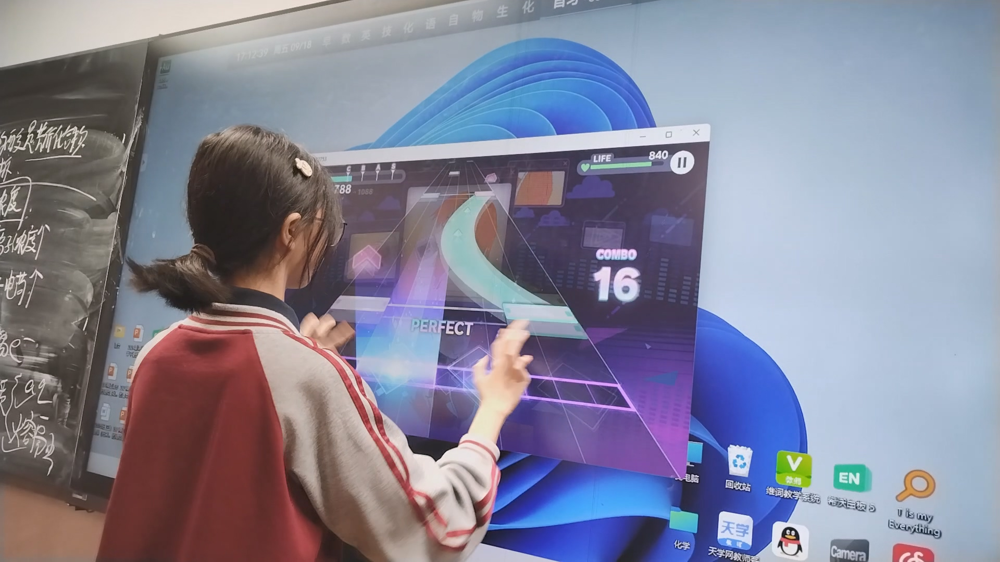
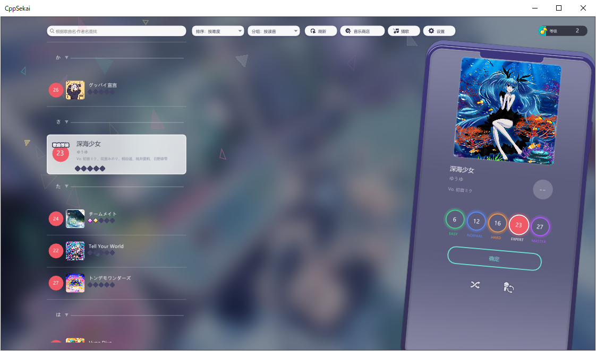

# CppSekai

> **把 Project SEKAI 的 SUS 谱面，做成一个双击就能玩的 Windows 原生 exe。**

没有 Electron，没有引擎，在班上垃圾希沃使用 Windows 原生触摸享受和同学打烤的快乐。



| 演奏 | 选歌 | 结算 |
| --- | --- | --- |
|  |  |  |

---

## 它到底能干什么

- **SUS 谱面原生解析 + 演奏**：12 轨，tap / critical tap / flick / trace(friction) / hold 全部支持。
- **判定对齐原作**：PERFECT / GREAT / GOOD / BAD / MISS 五档。出厂是**宽松**（官方窗口各放宽 30ms），设置里可切「标准 / 严格」，长条容错也能单独调。
- **三种输入共用一条路径**：键盘 12 键、鼠标左/右键（当成两个指针）、多指触摸。**XBOX 手柄只做菜单**（选曲 / 设置 / 弹窗），不参与打歌。
- **特效、时钟、对轴都不糊弄**：命中特效走核心自带的 pjsk 粒子系统；音频设备时钟就是主时钟（音画天然对齐）；官服 mp3 开头 ~9 秒静音自动扫掉，不用手动对轴。
- **结算画面照原版复刻**：得分、C/B/A/S 评级条、SCORERANK 牌子、PERFECT～MISS 计数与 COMBO。
- **设置六页**（`H` 或选曲界面的设置按钮）：音量 / 偏移 / 音符速度 / 分辨率 / 判定窗口与预设 / 严格 Flick / 自动演出 / 多开与多人游玩 / 昵称与等级 / 导入导出……全部持久化。
- **等级（Player Rank）**：照搬原版——一局经验 = 该局**分数评级倍率**（D 20 / C 200 / B 240 / A 280 / S 320），升级曲线用官方值（1 级 10、2 级 8010，3~12 级每级 +500，13~15 级每级 +1000，16 级起每级 +480，上限 900 级）。
- **账户是纯本地的**：昵称 / 学校 / 个性签名只写在本机档案里，游戏本体没有任何网络代码。
- **本地多人**：同一台机器开几个窗口一起打——第一个进来的是房主（选曲、放 BGM），其他人各挑难度、一起开始。走共享内存，不需要网络也不需要服务器。
- **系统集成**：Windows 媒体浮层（SMTC）显示曲名与进度，任务栏按钮上跑进度条（都只在 Win10+）。
- **无头自检**：`--screenshot` 能不开窗口跑一帧存 PNG，改渲染不用靠肉眼盯屏幕。

---

## 30 秒跑起来

```bash
bash setup.sh          # 拉工具链（zig 0.14.1 + SDL2 2.32.10）和贴图/音效资源
bash build.sh          # 编译，产物在 build/
cd build && ./cppsekai.exe
```

想顺便来两张测试谱面：

```bash
bash setup.sh --charts     # 额外下载 0075 / 0127 两张谱 + BGM 到 charts/
```

**不需要** Visual Studio、cmake、vcpkg、Python 环境。Windows 7 SP1 起、2008 年之后的核显就能跑
（Win7 上还得装一次 UCRT / VC++ 2015-2022 运行库；Win10+ 开箱即用）。

> 想下别的歌？仓库不自带谱面（官方素材不入库）→ 看 **[CHARTS.md](CHARTS.md)**。

---

## 操作

| 输入 | 操作 | 说明 |
| --- | --- | --- |
| 键盘 | `Z S X D C V G B H N J M` | 12 个键 = 12 条轨，`Z` 在最左 |
| 键盘 | `SPACE` | 暂停（开暂停弹窗） |
| 键盘 | `F` / `H` / `ESC` | 全屏切换 / 设置面板 / 返回 · 退出 |
| 键盘 | `F5` | 选歌界面重新扫描 `charts/`（加完谱面不用重启） |
| 鼠标 | 左键 / 右键 | 各算一个指针（可同时压两个轨），按住不放 = 长条 |
| 鼠标 · 触摸 | 上 / 左 / 右拖拽 | Flick，方向必须与箭头一致（严格模式默认开） |
| 触摸 | 多指 | 多指同时判定；触摸会合成鼠标事件喂给 UI，所有界面都能点 |
| 键盘 | —— | 只能清「上 / 无方向」的 flick；**左 / 右 flick 必须用鼠标拖拽或触摸** |
| 鼠标 · 触摸 | 选曲列表 | 滚轮 / 拖拽 / 触摸滑动都行；**滚动过程中不高亮**，松手后停在中间的那首才被选中。列表首尾相接循环，没有滚动条 |
| 鼠标 · 触摸 | 单击 / 双击某一行 | 单击 = 选中并滑到中间，双击 = 直接开打 |
| 手柄 | 方向键 / 左摇杆 | 上下选歌 + 换难度（按住连续） |
| 手柄 | `A` / `START` / `Y` | 开打 / 设置面板（演奏中 = 暂停）/ 重新扫描 |
| 手柄 | `B` / `BACK` | 关掉当前弹窗或设置卡（等同 `ESC` 的「返回」，不会误退出） |

> 手柄的实现是**把手柄按键翻译成键盘按键**，所以上表里的键盘操作手柄都能走一遍；演奏画面不吃手柄输入（12 轨的东西手柄打不了）。

---

## 设置面板（`H` 或选曲界面的设置按钮）

六个页签：**演奏**（音频偏移、音符速度、BGM / 音效音量、手柄震动与震动时机、自动演出）、
**画面**（界面缩放、分辨率、窗口模式、帧率上限、进度条、背景）、
**判定**（判定窗口预设 宽松 / 标准 / 严格 + 五根滑杆、长条容错、严格 Flick 方向、Flick 视作 Tap、初始血量）、
**系统**（失焦自动暂停、SMTC 汇报、多开与多人游玩、结束当前 / 所有实例）、
**账户**（用户切换与新建、昵称 / 学校 / 签名、等级经验、**导出 / 导入用户数据**）、
**关于**（版本、许可、链接、免责声明）。

全部设置随档案持久化，命令行参数优先于保存值。每一项的取值含义与实现细节见 **[AGENTS.md](AGENTS.md)**。

---

## 命令行

```bash
cppsekai [--sus <file.sus>] [--bgm <audio>] [--charts <dir>]
         [--offset <sec>] [--filler <sec>] [--auto] [--speed <1-12>]
         [--se-volume <0-1>] [--lead-in <sec>] [--cover <image>]
         [--screenshot <png>] [--screenshot-time <sec>]
         [--title/--lyricist/--composer/--arranger/--vocal/--difficulty <text>]
         [--width <px>] [--height <px>] [--window borderless|windowed|fullscreen]
         [--fps <n>] [--judge-sheet] [--test-hits] [--show-pause-dialog]
```

常用的几个：`--sus` 直接开一局（不给就进选歌界面）、`--offset` 手感微调、`--speed` 音符速度、
`--auto` 自动演示、`--screenshot` 无头截图、`--party` 临时加入多人房间、`--help` 看全部。

> 完整手册（每个参数、日志去哪、无头自检、退出码、踩过的坑）见 **[CLI.md](CLI.md)**。

---

## 数据文件

| 文件 | 位置 | 作用 |
| --- | --- | --- |
| `userdata.json` | `charts/` 同层的上一层（`build/` 布局下就是仓库根） | 玩家数据：`settings` + `scores`（通关 / FULL COMBO / 最高分）+ `account`（昵称 / 学校 / 签名 / 等级 / 经验 / 次数） |
| `profiles/<id>.json` + `profiles/index.json` | 同上 | 多用户：每个用户一份完整档案，index 记列表与当前用户。设置 → 账户 里能**导出 / 导入**单份文件 |
| `music-levels.json` / `musics.json` / `music-vocals.json` | 根目录 / exe 旁边 / 上级目录 | 官方等级定数、曲名与读音、演唱版本表。缺了也能开，只是难度定数、名称排序、版本切换会退化 |
| `charts/` | 放歌的地方 | `<4位id>_<难度>.sus` + BGM + 曲绘 + sidecar，规则见 **[CHARTS.md](CHARTS.md)** |

想清掉进度：删掉 `userdata.json`（设置一起回默认）；想只清设置：编辑文件里的 `settings` 段。
换电脑带走成绩：`charts/` 与 `userdata.json`（或整个 `profiles/`）一起拷走——成绩按谱面**文件名**存，两边文件名一致才认得出。

---

## Q&A

### 玩的时候

**Q：为什么没有歌 / 列表里是空的？**
A：仓库不自带谱面与音频（官方素材不入库）。三条路：`bash setup.sh --charts` 下两张测试谱、双击 `build/chartdl.exe` 批量下载、或者自己把文件丢进 `charts/`。命名必须是 `<4位id>_<难度>.sus`。

**Q：放进去了却不显示 / 歌名显示成 `0075 master`？**
A：前者基本是文件名不符合 `<4位id>_<难度>.sus`（或没按 F5 重扫）；后者是缺 sidecar 的 `title`。逐条对照见 **[CHARTS.md](CHARTS.md)** 的「常见问题」。

**Q：完全没有声音 / 音乐比谱面晚约 9 秒？**
A：没声音 = 谱面目录里少了对应的 mp3。晚 9 秒 = 官服 mp3 开头的静音填充没识别出来，sidecar 里写 `"fillerSec": 9.0` 即可（正常情况下程序会自己扫）。

**Q：判定手感不对，总觉得偏？**
A：先调 **设置 → 演奏 → 音频偏移**（±2000 ms，实时生效），对着判定线找这台设备的延迟；再调 **设置 → 判定** 的判定预设 / 判定窗口 / 长条容错。启动日志里 `[settings] windows perfect=… great=… good=… bad=… missAfter=… holdTail=… linked=…` 就是当前生效的那套数，汇报手感问题带上它最省事。

**Q：长条（hold）什么时候算断？**
A：尾判是**松手判定**——结束前在容错窗口内松手给 Perfect / Great / Good，一直按到底也是 Perfect，只有明显提前松手才断连。窗口在 **设置 → 判定 → 长条容错**。

**Q：键盘打不出左右 flick？**
A：键盘一个键没有方向，只能发向上 flick；左右方向必须用鼠标或触摸。触摸屏上滑很难触发的话，开 **设置 → 判定 → Flick 视作 Tap**。

**Q：手柄能打歌吗？**
A：不能，手柄只做菜单。12 轨的东西手柄打不了，这是有意的。

**Q：触摸屏能用吗？多指呢？**
A：能。触摸走 SDL 的 touch→mouse 合成，多指对应多轨；不想看到系统那圈触摸涟漪可以在设置里关掉。

**Q：怎么和别人一起打（同机联机）？**
A：**设置 → 系统 → 多人游玩**（会顺带允许多开，并问你要不要立刻重启进房）：每个窗口一个玩家，第一个进来的是房主，负责选曲和 BGM，其他人各自挑难度、一起开始。走同机共享内存，不需要网络，也没有服务器。想临时开一次用 `--party`。

**Q：为什么这首歌没有「切换歌手」/ 面板里只有一个版本？**
A：面板只列出**你谱面目录里真的存在音频的演唱版本**（`se_/vs_/an_/cl_<id>_<n>.mp3`），有几个就显示几张卡。切版本只换音轨，谱面是共用的。

**Q：界面字太小 / 太大？**
A：**设置 → 画面 → 界面缩放**。只作用于选曲和结算；演奏界面故意不跟着缩放。

**Q：自动演出（AUTOPLAY）会不会写成绩？**
A：**会加经验，但不写谱面成绩**——照官方的 AUTO LIVE 来（官方自动演奏同样给奖励，代价是消耗 Live 加成，我们这套没有加成系统）。全 PERFECT 的成绩记进「通关 / FULL COMBO / 最高分」等于把记录本作废，所以自动演出只结算经验与场次。命令行的 `--auto` 是给人看谱面的预览，**连经验也不给**。

**Q：为什么没有 3D MV / live2d / 角色？**
A：本项目的范围是「谱面播放器」：谱面、判定、舞台层、特效、UI 都在，MV 与角色不在其中。

### 装与跑

**Q：需要先装什么？**
A：什么都不用。`bash setup.sh` 会把 zig 工具链和贴图 / 音效一起拉下来，然后 `bash build.sh`。

**Q：Windows 7 能跑吗？**
A：能（SP1 起），但要自己装一次 **UCRT / VC++ 2015-2022 运行库**；Win10+ 开箱即用。媒体浮层（SMTC）与任务栏进度条只有 Win10+ 才有。

**Q：双击没反应 / 报缺 DLL？**
A：`SDL2.dll` 必须和 exe 放同一目录。日志写在**当前工作目录**的 `cppsekai.log`（不是 exe 旁边），先看它最后几行。

**Q：能跑在 Linux / macOS / 手机上吗？**
A：只做 Windows 原生：平台层用了 Win32 的媒体会话、任务栏进度和命名共享内存。想看网页版可以去上游 [sekai-mmw-preview-web](https://github.com/watagashi-uni/sekai-mmw-preview-web)。

**Q：会联网吗？会上传什么吗？**
A：游戏本体**没有任何网络代码**，断网照跑。只有 `chartdl.exe` 下载谱面时会联网（地址来自公开的资源镜像），也不上传任何东西。

---

## 授权与素材

- 代码遵循 **AGPL-3.0-only**：改了要开源，发二进制（包括发 exe）要附许可并指向源码。
  - 上游：[sekai-mmw-preview-web](https://github.com/watagashi-uni/sekai-mmw-preview-web)（AGPL-3.0）——谱面核心与渲染布局来自这里
  - 再上游：MikuMikuWorld（MIT）——`core/native/mmw_port/` 的移植来源
  - 第三方库（imgui / miniaudio / stb / nlohmann-json / DirectXMath）各自遵循宽松许可；SDL2 是 **zlib**，发 DLL 要一并带上
  - 逐个来源的完整台账见 **[CREDITS.md](CREDITS.md)**，风险与「什么能发什么不能发」见 **[COPYRIGHT.md](COPYRIGHT.md)**
- **素材全部属于 SEGA / Colorful Palette**：`assets/` 与 `charts/` 是官方游戏素材与数据，**仅限本地游玩**，别随包分发。
- 本项目与官方无关；如有侵权请联系移除。

---

## 想往下看哪里

| 文档 | 里面有什么 |
| --- | --- |
| **[AGENTS.md](AGENTS.md)** | 给改代码的人（和 AI）的项目指南：三层架构、数据格式、谱面坐标与时间轴、每一条踩过的坑 |
| **[CLI.md](CLI.md)** | 完整命令行手册：参数、日志、无头自检、退出码 |
| **[CHARTS.md](CHARTS.md)** | 谱面目录怎么摆、命名规则、下载地址与 URL 模板、常见问题 |
| **[SETUP.md](SETUP.md)** | `setup.sh` 到底拉了些什么、离线怎么办 |
| **[CODE-REVIEW.md](CODE-REVIEW.md)** | 代码体量体检与重构顺序 |
| **[COPYRIGHT.md](COPYRIGHT.md)** · **[CREDITS.md](CREDITS.md)** | 版权边界 与 借用清单 |
